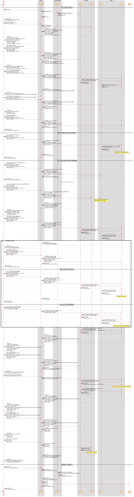

# The Login flow

The "Login" flow describes the interactions that occur when an unauthenticated request sent.
There is a lot of moving parts, and even more requests to make it work.
Seen from a far, this is what happens:

1. The browser makes a request. NGINX detects using Oathkeeper and Hydra that Login-Cookie is not set, so redirects the browser to Pascal.
2. Pascal starts a OAuth2 token flow using Hydra, which redirects the browser to Login to select a tenant.
3. Login detects using Kratos that User-Cookie is not set, so it starts a login flow using Kratos which redirects the browser to Login to select an identity provider.
4. User selects a provider and authenticates, which redirects the browser back to Kratos to set the User-Cookie, and back to the select tenant page.
5. User selects a tenant, which redirects the browser back to Hydra to generate the token, and in turn to Pascal to store the token in the Login-Cookie
6. The browser is finally redirected back to the original request, and now NGINX using Oathkeeper and Hydra gets the information from the Login-Cookie and forwards the information to Studio.

## Detailed flow description
